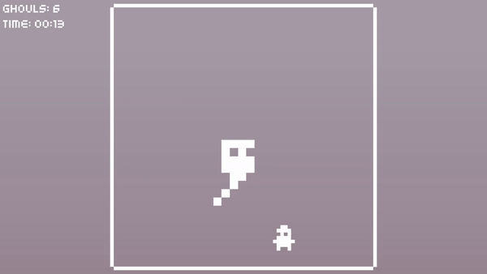

# Ghoul Must Eat

Originally made in one week for Weekly Game Jam 203 with theme "Eat the Enemy".

It has since received post-jam fixes and feature improvements.

## Summary
<table>
    <tbody>
        <tr>
            <td valign="top">Made with</td>
            <td>
                C# &amp; Unity
                 
                Aseprite, GIMP
                 
                CC0 and PD assets
                 
                ChatGPT (AI-assisted time formatting)
            </td>
        </tr>
        <tr>
            <td>Timeline</td>
            <td>1 week + post-release improvements</td>
        </tr>
        <tr>
            <td>Playable</td>
            <td><a href="https://stevepdp.itch.io/ghoul-must-eat" title="Play the game on Itch.io">Itch.io</a></td>
        </tr>
        <tr>
            <td>Post Mortem</td>
            <td><a href="https://stevepdp.dev/games/weekly-game-jam/ghoul-must-eat.html" title="Read the retrospective on stevepdp.dev">Ghoul Must Eat - Retrospective</a></td>
        </tr>
    </tbody>
</table>

## Credits

### Fonts
* "Kenney Mini" by "Kenney" is licensed CC0 1.0 Universal:
  * https://www.kenney.nl/assets/kenney-fonts
  * https://creativecommons.org/publicdomain/zero/1.0/legalcode

* "Kenney Mini Square" by "Kenney" is licensed CC0 1.0 Universal:
  * https://www.kenney.nl/assets/kenney-fonts
  * https://creativecommons.org/publicdomain/zero/1.0/legalcode

### Shaders
* Free gradient shader for Unity by Alex Strook:
  * https://twitter.com/AlexStrook/status/1294735487513645058
